# swarm-oidc
[WildFly Swarm](http://wildfly-swarm.io/) OpenID Connect ([OIDC](http://openid.net/connect/)) [Fraction](https://wildfly-swarm.gitbooks.io/wildfly-swarm-users-guide/content/fraction_authoring.html)

WildFly Swarm provides a Keycloak adapter that can be used in conjunction with a Keycloak server. Additionally the Keycloak solution includes OIDC adapters for various JavaEE application servers. This fraction was developed with the following motivations:
 * The Keycloak and WildFly Swarm Keycload adapter documentation is unclear if they are compatible with third party OIDC providers such as Okta.
 * Using a bundled adapter can be advantageous in many circumstances but in other situations having top-to-bottom access to the authentication pipeline is preferable. Opening up the OIDC relying party authentication logic can allow more elaborate functionality than can be provided by the stock Keycloak adapter such as local account autoprovisioning or accepting OIDC tokens from multiple identity providers. 
 
 * OIDC and Microservices are intended to be lightweight and this alternative WildFly/Swarm fraction has fewer dependencies than Keycloak and can be used as a reference implementation for custom WildFly Swarm authentication extensions.
 
## Design Considerations
 
 * This fraction was developed based on guidance from the WildFly Swarm faction authoring guide and examples of custom WildFly authentication modules
 * The [Nimbus OAuth 2.0 SDK with OpenID Connect extensions](http://connect2id.com/products/nimbus-oauth-openid-connect-sdk) library is used to perform the OIDC interactions with the Identity provider 
 * The ODIC configuration settings could have been defined through a WildFly sub-system extension however that would have added additional complexity beyond the configuration functionality provided by WildFly Swarm. Also with recent changes to WildFly and the evolving nature of WildFly Swarm documentation on developing sub-system extensions is either not current or available. Instead the OIDC configuration is stored in a swarm project stages YML file. 
 * WildFly authentication extensions have two points of authentication: Undertow and JAAS. The Undertow [AuthenticationMechanism](https://github.com/undertow-io/undertow/blob/master/core/src/main/java/io/undertow/security/api/AuthenticationMechanism.java) performs the OIDC web choreography  while the [LoginModule](https://github.com/picketbox/picketbox/blob/master/security-jboss-sx/jbosssx/src/main/java/org/jboss/security/auth/spi/AbstractServerLoginModule.java) fulfills the JavaEE authentication requirements.
 * Role names are passed into the loginmodule via a non-standard claim named "groups"
 * The OIDC metadata URL is retrieved and parsed at startup time. If a network connection is not available the authentication module will not initialize and the container will need to be restarted. The JWS certificates could automatically rotate and the container would need to be restarted if this happens to pickup the latest metadata changes. 
 * By default the fraction stores the redirect URL state value and nonce value in the JavaEE HTTPSession for verification. This goes against the principle of stateless microservices that can be horizontally scaled without service disruption. The ODIC configuration can be set to not use a nonce and to encrypt the redirect URL state with a shared key if on demand scaling is needed. 
 * The fraction provides a Secured interface similar to the Keycloak fraction so that that protected path declarations can be programatically made instead of specified in the web.xml or with the standard JavaEE annotations. This is an optional feature.
 
 ##Keycloak Setup
 
1. Start the Keycloak server - Current fraction version incompatibilities prevent both the OIDC fraction and the Keycloak server from being started in the same Swarm application. Download the keycloak server from [here](https://repo1.maven.org/maven2/org/wildfly/swarm/servers/keycloak/2016.8.1/keycloak-2016.8.1-swarm.jar) and start it using the command:
`java -Dswarm.http.port=9090 -jar keycloak-2016.8.1-swarm.jar`  
 
1. Access http://localhost:9090/auth/admin and login or create an admin account
 
1. Create a new realm named demo
 
1. Create a new user and set a password

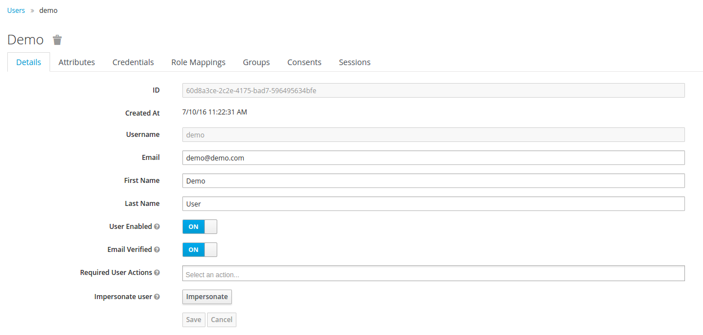
 
1. Create a new group. There may be a way to include role assignments in the OIDC token claim but the configuration is not apparent.

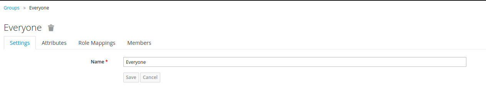

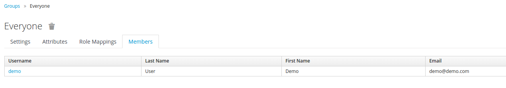
 
1. Create a new client template


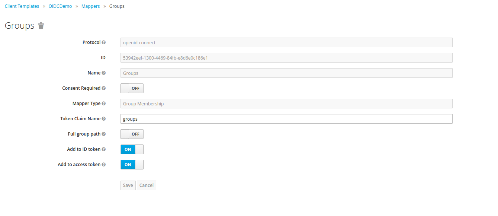
 
1. Create a new client. Be sure to enable the implcit flow
 
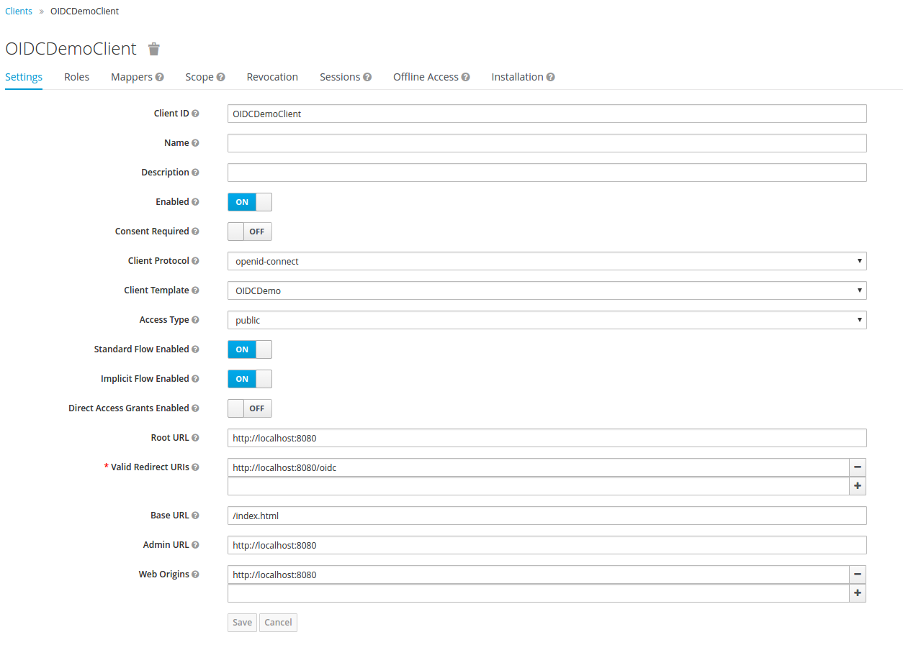

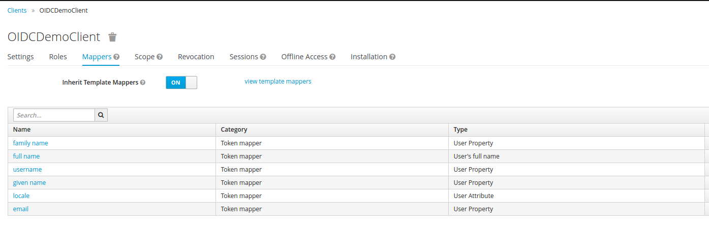
 
1. Edit the test/src/main/resources/project-stages.yml and make sure the Keycloak configuration is set

``` yml

swarm:
  oidc:
    realm: demo
    clientId: OIDCDemoClient
    metadataURL: http://localhost:9090/auth/realms/demo/.well-known/openid-configuration


```
 
##Okta Setup  
1. Log into the Okta admin interface 
  
1. Create a new application and configure it. Be sure to enable the implicit flow 

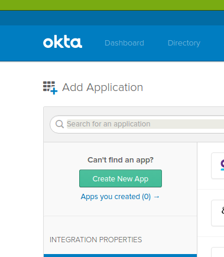

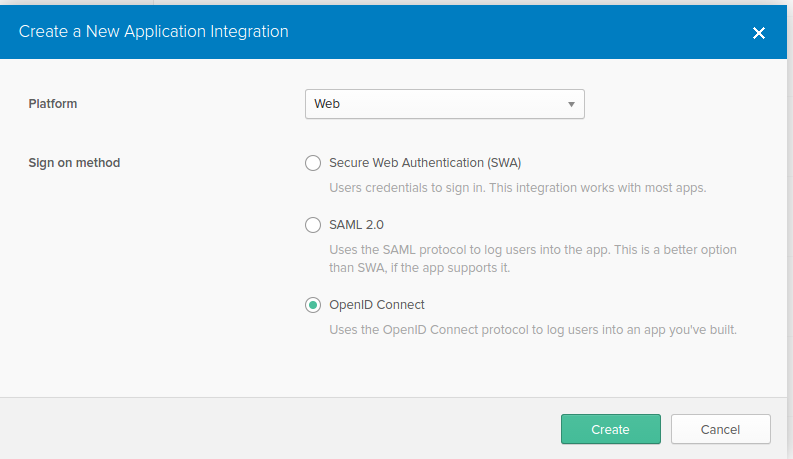

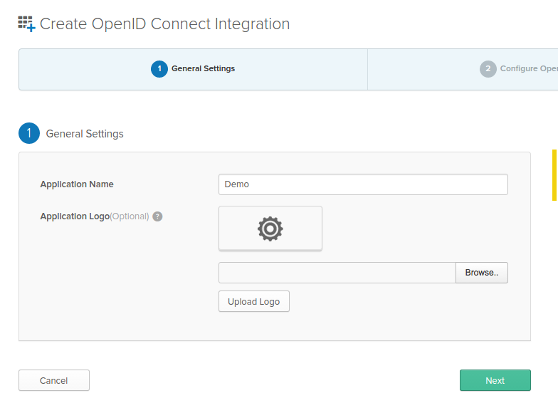

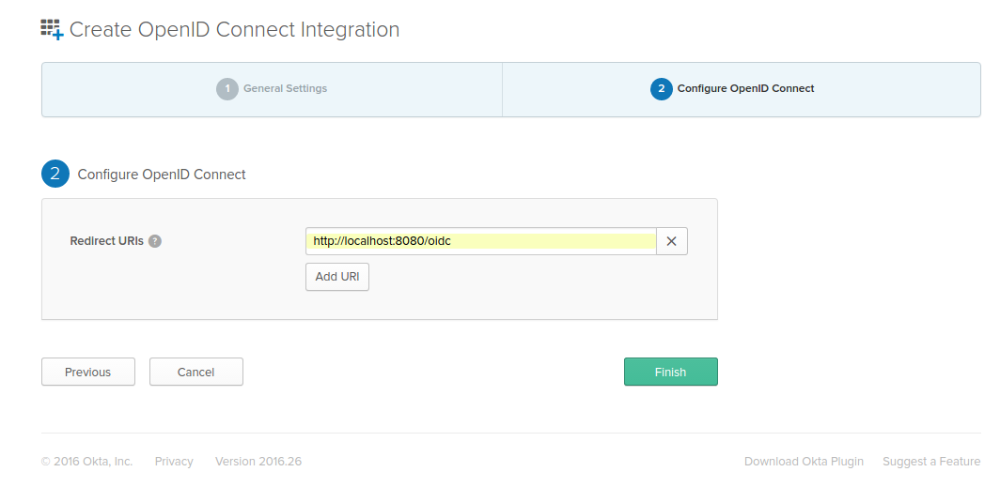

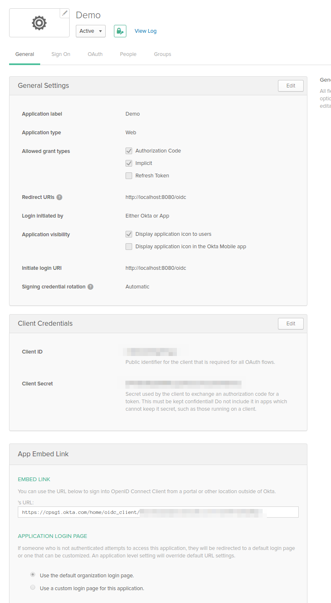

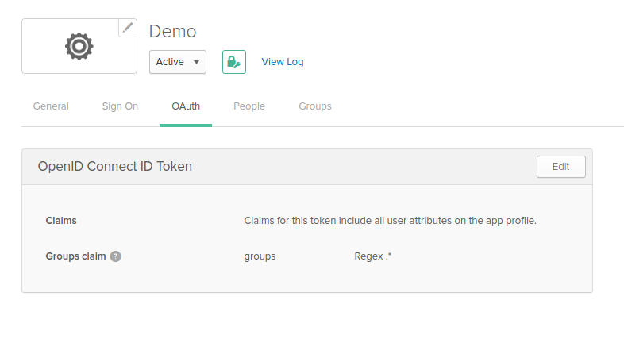
 
 
1. Edit the test/src/main/webapp/WEB-INF/oidc.json and make sure the Keycloak configuration is set. Update the clientId with the value from Okta. Also be sure to override the scope setting so that groups are retrieved.

``` yml
swarm:
  oidc:
    realm: demo
    clientId: aaaaaaaaaaaaaaaaaaaaaa
    metadataURL: https://OKTA_ORG.okta.com/.well-known/openid-configuration


``` 

##Running the Application
1. Star the test application and access it

`mvn install; java -jar -Xdebug -Xrunjdwp:transport=dt_socket,server=y,suspend=n,address=8000 target/oidc-test-0.0.1-SNAPSHOT-swarm.jar`

The application can also be run with 

`mvn wildfly-swarm:run` 
 
